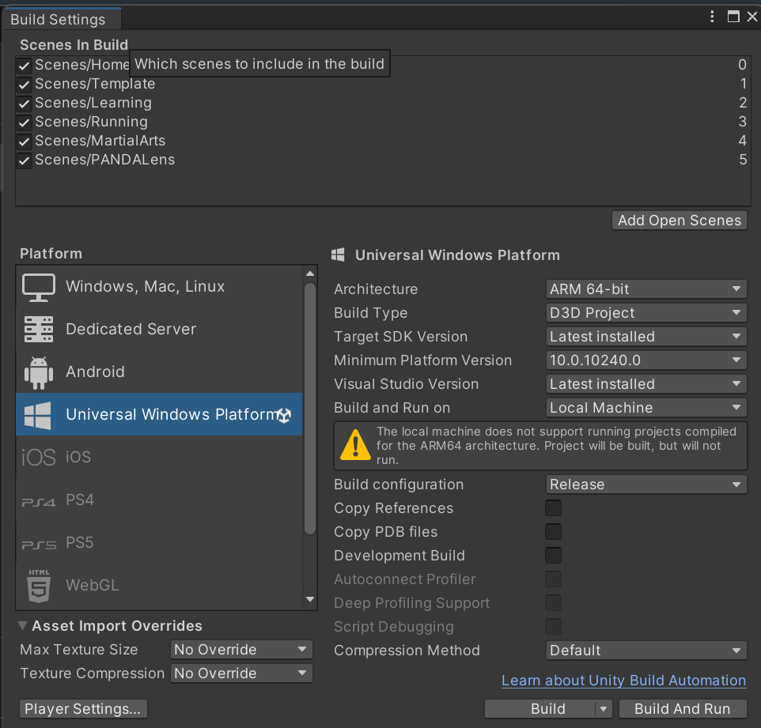

# TOM-Client-Unity

A Unity implementation of the client to support smart glasses and phones that receive data from the server
- This [Unity3D](https://unity.com/) client serves as the primary front-end interface for devices such as smart glasses and phones. 
- Users directly interact with this interface. 
- It's constructed using [MRTK 2.8](https://github.com/microsoft/MixedRealityToolkit-Unity/tree/releases/2.8.3) and employs web socket communication to connect with the [TOM-Server-Python](../TOM-Server-Python).


## Requirements
- For HoloLens2 development, you need to use a Windows 10+ PC. Add the required [prerequisites for HoloLens development](https://learn.microsoft.com/en-us/training/modules/learn-mrtk-tutorials/1-1-introduction#prerequisites)
  - Install the [development tools](https://learn.microsoft.com/en-us/windows/mixed-reality/develop/install-the-tools) (e.g., Unity3D, Visual Studio)
  - Connect HoloLens 2 via a browser (e.g., [WiFi](https://learn.microsoft.com/en-us/windows/mixed-reality/develop/advanced-concepts/using-the-windows-device-portal#connecting-over-wi-fi)).
    - For first-time use (and if you don't have a username and password), request a [PIN](https://learn.microsoft.com/en-us/windows/mixed-reality/develop/advanced-concepts/using-the-windows-device-portal#creating-a-username-and-password).
- For voice dictation in HoloLens, make sure there is an active internet connection and online speech recognition service ( "Setting - > Privacy -> Speech "-> Turn on "Online speech recognition" and "Speech recognition").


## Installation
- Open the project in Unity
- Follow the platform-specific instructions below

### HoloLens2
- Configure *only* the Build Settings - see [Hololens with MRTK](https://learn.microsoft.com/en-us/training/modules/learn-mrtk-tutorials/1-3-exercise-configure-unity-for-windows-mixed-reality#switch-build-platform) 
- Create a `tom_config.json` file inside `Videos/TOM` directory in HoloLens2. 
  - To do this, either connect to the device via WiFi or USB and replace the file:
    - [WiFi](https://learn.microsoft.com/en-us/windows/mixed-reality/develop/advanced-concepts/using-the-windows-device-portal#connecting-over-wi-fi) – Use the [File Explorer](https://learn.microsoft.com/en-us/windows/mixed-reality/develop/advanced-concepts/using-the-windows-device-portal#file-explorer).
    - USB connection – Connect as a media device.
- Add the server address to the `tom_config.json` as follows
	- ```javascript
		{"host":"<IP_ADDRESS>","port":"8090"}
	  ```
	- NOTE: both the device (e.g., HoloLens2) and [server](https://github.com/NUS-SSI/TOM-Server-Python) computer should be connected via a PRIVATE network (e.g., phone hotspot)
- To auto stop the voice dictation after a timeout, modify the voice integration of MRTK for HL2 in `WindowsDictationInputProvider.cs`.
  - Search `WindowsDictationInputProvider` in the project using "All" (not "In Assets"), open the script, and modify the `DictationRecognizer_DictationComplete` method in *lines 392-408* as follows:
  - ```cs
    private void DictationRecognizer_DictationComplete(DictationCompletionCause cause){ 
        using (DictationCompletePerfMarker.Auto()){
            if(cause == DictationCompletionCause.TimeoutExceeded){
                Microphone.End(deviceName);
                dictationResult = textSoFar.ToString();
                StopRecording();
            }
            Service?.RaiseDictationComplete(inputSource, dictationResult, dictationAudioClip);
            textSoFar = null;
            dictationResult = string.Empty;
        }
    }
    ```
- **[For testing the app on a real device]** Build the project and deploy it to the HoloLens 2 device.
    - If your scene requires default voice transcription on the HoloLens, ensure that the scene is set as the first (i.e., 0 index) scene in `Build Settings` (by default, this will be `Scenes/Home`).
        - 
- **[For simulating the app on real device]** Instead of building the project, you can also use the Unity Editor with [Holographic Remoting Player](https://learn.microsoft.com/en-us/windows/mixed-reality/develop/native/holographic-remoting-player) to simulate the application on the HoloLens2 device.
  - Install the [Holographic Remoting Player](https://www.microsoft.com/p/holographic-remoting-player/9nblggh4sv40) on the HoloLens2 device and start the app.
  - Enable remoting on Unity Editor by going to `Mixed Reality -> Remoting -> Holographic Remoting for Play Mode`, add the IP address of the HoloLens2 device, and `Enable Holographic Remoting for Play Mode`.
  - `Play` the Unity application on Unity Editor, which will show the holographic view on the HoloLens2 device.
  - Simulation enable to use certain real sensor data from HoloLens2 (e.g., gaze, hand tracking, eye tracking, etc.). For voice input it may use the Windows computer's microphone. 
- [For voice dictation in simulator] In the Windows PC, make sure there is an active internet connection and online speech recognition service ( "Setting - > Privacy & Security -> Speech"-> Turn on "Online speech recognition").
- [Optional] Check that "Default orientation*" (from Project Settings... > Player > Resolution and Presentation > Orientation) is set to "Auto-rotation" 

### XREAL
- NOTE! -- The XRSDK package/folder is not included in this repository.
- To build for XREAL, follow these steps: 
  1. Install NRSDK folder: 
     - Download version 1.10.2 XRSDK from: https://xreal.gitbook.io/nrsdk/nrsdk-fundamentals/release-note/nrsdk-1.10.2
     - Import the package via Unity > Assets > Import Package > Custom Package.. 
     - (Higher versions might work, but untested yet)
  2. Switch build target platform to Android. 
  3. Add ```BUILD_XREAL``` into scripting define symbols in Project Settings.. > Android Tab > Other Settings > Scripting Define Symbols
     - This is necessary for the XREALController code segments to take effect.
     - (Note that UnityEngine.Windows.WebCam classes are auto-excluded by ```UNITY_ANDROID``` scripting definition -- https://docs.unity3d.com/Manual/PlatformDependentCompilation.html)
- Check that "Default orientation*" (from Project Settings... > Player > Resolution and Presentation > Orientation) is set to "Portrait". 
  - This setting is also auto-applied by XREAL project validator. (https://docs.xreal.com/Getting%20Started%20with%20NRSDK#3-configure-project-settings)

### Simulator (Unity Editor)
- Make sure both the Unity Editor (Simulator) and [server](../TOM-Server-Python) are running on the same computer so that the server address is `127.0.0.1` (localhost)
- Create a `tom_config.json` file inside `Videos/TOM` in the computer's home directory
- Use the `127.0.0.1` as the server address in the `tom_config.json` as follows
    - ```javascript
    	{"host":"127.0.0.1","port":"8090"}
	  ```


## Application execution
- Start the [TOM-Server-Python](../TOM-Server-Python) to establish a socket connection
- Run the (Unity) client application in the respective platform (HoloLens2, Nreal, or Simulator)


## Development
- See [DeveloperGuide.md](DeveloperGuide.md) for more details on development guidelines.


## References
- [Unity Learn](https://learn.unity.com/)
- [MixedRealityToolkit-Unity](https://github.com/microsoft/MixedRealityToolkit-Unity)
- [mixed-reality-toolkit-project-unity](https://learn.microsoft.com/en-us/training/modules/mixed-reality-toolkit-project-unity/)
- [HoloLens 2 fundamentals: develop mixed reality applications](https://learn.microsoft.com/en-us/training/paths/beginner-hololens-2-tutorials/)

### Eye tracking
- [Eye tracking on HoloLens 2](https://learn.microsoft.com/en-us/windows/mixed-reality/design/eye-tracking)
- [Enable eye-tracking ](https://learn.microsoft.com/en-us/training/modules/use-eye-tracking-voice-commands/)
- [Getting started with eye tracking in MRTK2](https://learn.microsoft.com/en-us/windows/mixed-reality/mrtk-unity/mrtk2/features/input/eye-tracking/eye-tracking-basic-setup?view=mrtkunity-2022-05)
- [Eyes and hands — MRTK2](https://learn.microsoft.com/en-us/windows/mixed-reality/mrtk-unity/mrtk2/features/input/eye-tracking/eye-tracking-eyes-and-hands?view=mrtkunity-2022-05)

